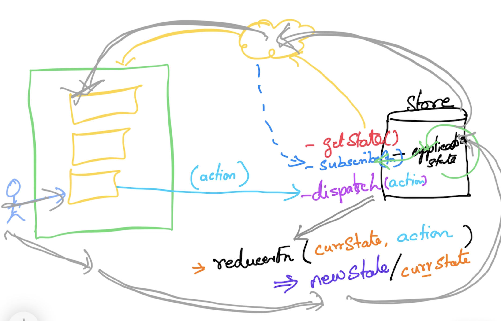

# React Training

## Magesh Kuppan

## Chat
- https://chat.olzhasar.com/r/87c5ffc2-0eb8-4cb7-b2fb-760c1508697f

## Schedule
- Session - 1   : 1:30 hrs
- Tea Break     : 20 mins
- Session - 2   : 1:40 hrs
- Lunch Break   : 1 hr
- Session - 3   : 1:30 hrs
- Tea Break     : 20 mins
- Session - 4   : 1:40 hrs

## Methodology
- No powerpoint
- Code & Discussion
- No dedicated time for Q&A

## Software Requirements
- Chrome Browser
- Node.js (LTS - v20.12.1)
- Visual Studio Code (or any editor)

## Reference
- Advanced JS (https://bit.ly/javascript-training-videos)
- React (https://bit.ly/react-videos)

## Repository
- https://github.com/tkmagesh/shell-react-apr-2024

## What is React?
- Library for building **Rich Internet Applications**


## Zen Coding Syntax
- https://code.google.com/archive/p/zen-coding/
```
html:5
div*3
div#div-1
div.highlight
input:text
input:check
input:range[min="0" max="10" value="0"]
div>span
div+span
div*3#div-$
div{This is the content of a div}
```
## Salary Calculator
- Salary = Basic + HRA + DA - Tax

## React

### VDOM
- Presentation

### JSX
- Every tag MUST have a corresponding close tag
- Use 'htmlFor' inplace of 'for'
- Use 'className' inplace of 'class'

### Component (View)
- Encapsulation of Presentation + User Interaction Logic (handling user events) + State
- Just a function (with the name starting with capital letter)

### Hooks
- Functions designed to handle side-effects
- Functions whose name starts with 'use'
- Hook functions can be used ONLY in a component function
- Built in hooks
    - useState
        - used to maintain state across the component re-renderings
    - useRef
    - useReducer
    - useEffect
    - etc

## State Manager
